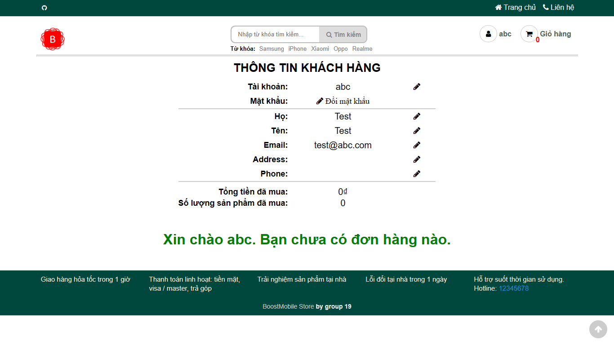
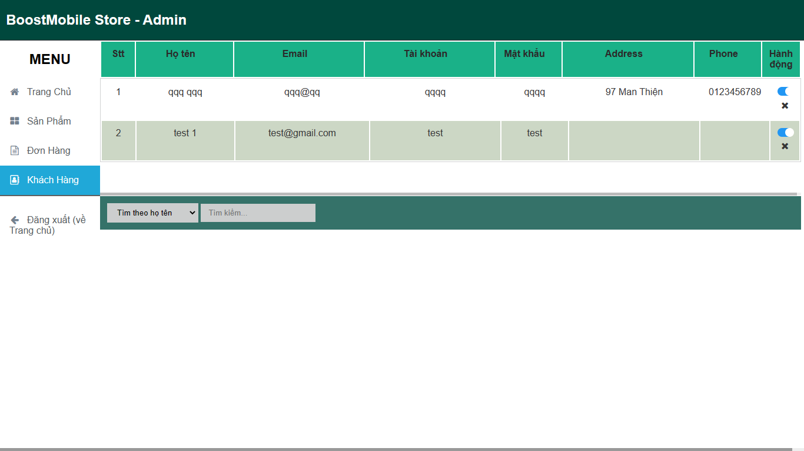

# Nhom19_WebMobile

Đồ án web web bán điện thoại di động (admin & users).

Chức năng _Cơ bản_:

- Tìm kiếm/lọc/sắp xếp sản phẩm theo hãng, giá, tên, khuyến mãi, số sao, ...
- Đăng ký, đăng nhập, giỏ hàng, trang người dùng, lịch sử mua hàng.
- Trang chi tiết sản phẩm.

Chức năng **ADMIN**:
_Quản lý sản phẩm_: Admin cần có quyền truy cập để thêm, sửa và xoá sản phẩm trên trang web,(tìm kiếm/lọc/sắp xếp, thêm/sửa/xóa sản phẩm).
_Quản lý đơn hàng_: Admin cần có khả năng theo dõi đơn hàng từ khách hàng và cập nhật trạng thái đơn hàng,(tìm kiếm/lọc/sắp xếp, duyệt/hủy đơn hàng).
_Quản lý khách hàng_: Admin cần có quyền truy cập để tạo, sửa, và xoá tài khoản người dùng trên trang web,(tìm kiếm/lọc/sắp xếp, duyệt/hủy đơn hàng).
_Quản lý thống kê báo cáo_: Admin cần có khả năng tạo báo cáo về doanh thu, sản phẩm, và khách hàng để đưa ra quyết định kinh doanh,(sử dụng biểu đồ để thống kê).

Chức năng **USERS**:
_Tìm kiếm sản phẩm_: Users cần có khả năng tìm kiếm sản phẩm trên trang web theo từ khóa hoặc theo danh mục sản phẩm,(tìm kiếm/lọc , sắp xếp)
_Đặt hàng, mua hàng_: Users cần có khả năng đặt hàng trên trang web và thanh toán bằng phương thức thanh toán trực tuyến hoặc thanh toán khi nhận hàng,(thêm/xóa sản phẩm).
_Theo dõi đơn hàng_: Users cần có khả năng theo dõi đơn hàng của mình và biết được trạng thái của đơn hàng.
_Xem thông tin chi tiết sản phẩm_: Users cần có khả năng xem thông tin chi tiết về sản phẩm trên trang web, bao gồm hình ảnh, mô tả sản phẩm, giá cả và đánh giá từ người dùng khác,(thêm/xóa sản phẩm vào giỏ hàng).

## Admin Account:

- username: nhom19
- password: 12345

## Screenshots

### Cơ bản

Trang chủ

Sản phẩm trong trang chủ

Chi tiết sản phẩm

Đăng nhập

Đăng ký

Trang người dùng

Giỏ hàng

Tìm kiếm/lọc/sắp xếp sản phẩm

### Admin

Admin: Thống kê

Admin: Sản phẩm

Admin: Đơn hàng

Admin: Người dùng

#### Các công nghệ sửa dụng trong đồ án:

**HTML**: HTML là ngôn ngữ đánh dấu siêu văn bản được sử dụng để tạo ra cấu trúc và nội dung của trang web. Nó được sử dụng để tạo ra các phần tử, định dạng, và liên kết đến các tài liệu khác.

**CSS**: CSS là ngôn ngữ định dạng được sử dụng để tạo ra bố cục và trang trí cho các phần tử trên trang web. CSS cho phép các nhà thiết kế tạo ra giao diện người dùng đẹp mắt và dễ sử dụng.

**JavaScript**: JavaScript là một ngôn ngữ lập trình được sử dụng để tạo ra các hiệu ứng động trên trang web. Nó cho phép các nhà phát triển thêm tính năng tương tác vào trang web và cải thiện trải nghiệm người dùng.

**jQuery**: jQuery là một thư viện JavaScript được sử dụng để giảm thiểu thời gian và công sức để viết mã JavaScript. Nó cho phép các nhà phát triển tạo ra các hiệu ứng động và tương tác với các phần tử trên trang web một cách dễ dàng hơn.

**Owl Carousel**: Owl Carousel là một plugin jQuery được sử dụng để tạo ra các slideshow và carousel trên trang web. Nó cho phép các nhà thiết kế tạo ra các trình chiếu ảnh và video ấn tượng trên trang web của họ.

**LocalStorage**: LocalStorage là một tính năng của HTML5 được sử dụng để lưu trữ dữ liệu trên máy khách. Nó cho phép trang web lưu trữ các thông tin về người dùng và tùy chỉnh các cài đặt trên trình duyệt của họ để cải thiện trải nghiệm người dùng.

##### Cách chạy chương trình:

**Yêu cầu có VS Code**
**Cài đặt extendtion 'Live Server' cho VS Code**
**Chạy file 'nguoidung.html' trên port 5500 có sẵn trên 'Live Server'**

###### Thành viên nhóm:

Phạm Văn Hùng -N21DCCN035
Vũ Gia Huy    -N21DCCN039
Hồ Anh Tuấn   -N21DCCN089
Bùi Hữu Trí   -N21DCAT058
